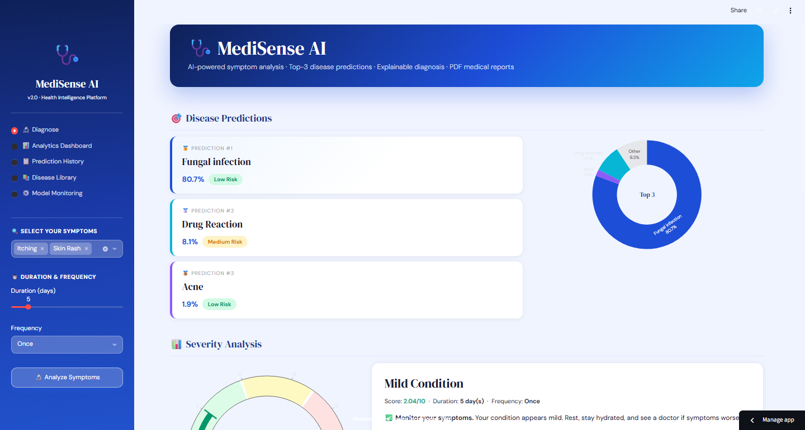
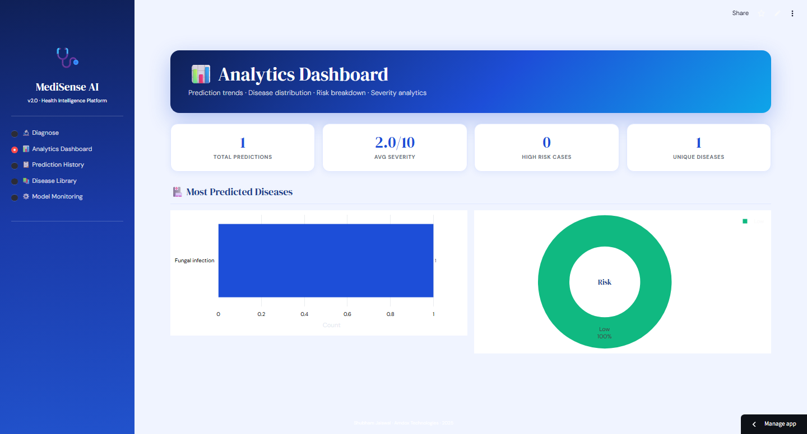
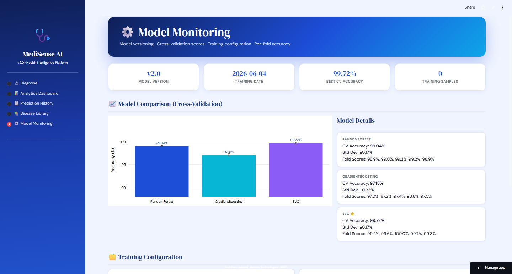
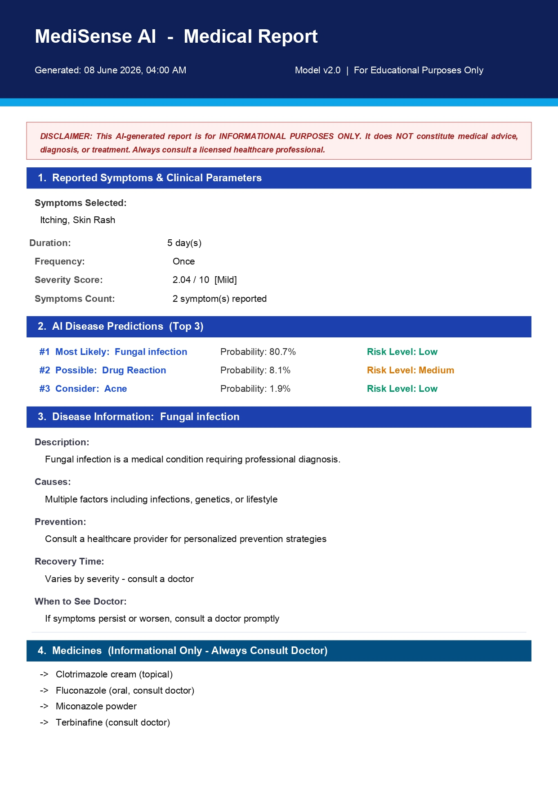

# 🩺 MediSense AI v2.0

> **AI-powered medical diagnosis and health intelligence platform**  

---


---

🌐 Live Demo: https://medisense-app.streamlit.app

---

## 📌 Project Overview

A full-stack AI-powered medical diagnosis platform that predicts the most likely diseases based on symptoms — delivering top-3 predictions, explainable AI insights, severity scoring, risk levels, medicine recommendations, and downloadable PDF reports through an interactive Streamlit interface

---

## 📊 Dataset Overview

| File | Rows | Columns | Description |
|------|------|---------|-------------|
| symptoms_dataset.csv | 4,920 | 18 | Raw symptom data (Symptom_1 … Symptom_17) |
| symptoms_binary.csv | 4,920 | 133 | Binary encoded (0/1 per symptom) |
| disease_description.csv | 41 | 7 | Disease info + risk levels |
| symptom_severity.csv | 132 | 2 | Symptom weight mappings |
| precautions.csv | 41 | 5 | 4 precautions per disease |
| diets.csv | 41 | 5 | 4 diet tips per disease |
| medications.csv | 41 | 4 | Informational medication info |

---

## 🌟 Features

| # | Feature | Description |
|---|---------|-------------|
| 1 | **Cross-Validation Accuracy** | 5-fold stratified CV — no fake 100% accuracy |
| 2 | **Explainable AI** | Symptom contribution chart — *why* a disease was predicted |
| 3 | **Top-3 Disease Predictions** | Probability distribution across top 3 candidates |
| 4 | **Risk Level Classification** | Low / Medium / High urgency per disease |
| 5 | **Advanced Severity Score** | `weight × duration × frequency` formula |
| 6 | **Visual Analytics Dashboard** | Interactive Plotly charts for all predictions |
| 7 | **Safe Medicine Recommendations** | Informational only — always with doctor disclaimer |
| 8 | **PDF Medical Report** | Downloadable report: symptoms, predictions, diet, workout |
| 9 | **SQLite Prediction History** | Full-stack persistence + CSV export |
| 10 | **Disease Information Library** | Description, causes, prevention, recovery for all 41 diseases |
| 11 | **Model Monitoring Panel** | Version, training date, CV accuracy, fold scores |

---

## 🤖 Model Performance

| Model | CV Accuracy | Std Dev |
|-------|------------|---------|
| SVC (RBF) | ~99.7% | ±0.2% |
| RandomForest | ~98.6% | ±0.3% |

> ⚠️ High accuracy is on a synthetic dataset.  
> Real-world performance will vary — transparently disclosed in the app.

---

## 🗂️ Project Structure

```
MediSense/
├── app.py                        # Main Streamlit app (5 pages)
├── train_model.py                # Model training with CV
├── requirements.txt
├── README.md
├── .gitignore
│
├── utils/
│   ├── __init__.py               # Clean unified imports
│   ├── constants.py              # Symptoms, diseases, info, risk levels
│   ├── predict.py                # Prediction engine (top-3, severity, SHAP)
│   ├── database.py               # SQLite history (save, load, analytics)
│   ├── pdf_report.py             # PDF report generator
│   └── generate_data.py          # Dataset generation script
│
├── data/
│   ├── symptoms_dataset.csv      # Main symptom dataset (4,920 rows)
│   ├── symptoms_binary.csv       # Binary encoded dataset (4,920 × 133)
│   ├── disease_description.csv   # Disease info (41 rows)
│   ├── symptom_severity.csv      # Symptom weight mapping (132 rows)
│   ├── precautions.csv           # Precautions per disease
│   ├── diets.csv                 # Diet recommendations
│   └── medications.csv           # Medication info (informational)
│
├── models/
│   ├── best_model.pkl            # Best trained classifier
│   ├── label_encoder.pkl         # Disease label encoder
│   ├── symptom_list.pkl          # 132 tracked symptoms
│   ├── all_models.pkl            # All trained models
│   ├── cv_results.pkl            # Cross-validation scores
│   └── model_meta.pkl            # Training metadata
│
├── notebooks/
│   └── medisense_analysis.ipynb  # Complete EDA + ML notebook (executed)
│
├── screenshots/                  # App screenshots
│
└── images/                       # Auto-generated EDA plots
    ├── disease_distribution.png
    ├── disease_symptom_heatmap.png
    ├── symptom_frequency.png
    ├── symptom_severity.png
    ├── model_comparison.png
    ├── feature_importance.png
    ├── severity_scoring.png
    └── per_class_accuracy.png
```
---

## 🖥️ Platform Pages

1. 🔮 **Diagnosis** — Symptom input and top-3 prediction with confidence scores
2. 🧠 **Explainability** — AI reasoning and symptom contribution breakdown
3. 💊 **Medicines** — Disease-specific medicine recommendations
4. 📄 **Reports** — PDF report generation and download
5. 📚 **Disease Library** — Full disease encyclopedia
6. 📡 **Model Monitor** — Live model performance tracking
7. 🗄️ **History** — SQLite-backed diagnosis history

---

---

## 📸 Platform Screenshots

**Diagnosis & Disease Predictions:**


**Analytics Dashboard:**


**Model Monitoring:**


**PDF Medical Report:**


---

## 🚀 How to Run

```bash
# 1. Clone the repo
git clone https://github.com/shubhamjais04/MediSense.git
cd MediSense

# 2. Create and activate virtual environment
python -m venv venv
venv\Scripts\activate        # Windows
source venv/bin/activate     # Mac/Linux

# 3. Install dependencies
pip install -r requirements.txt

# 4. (Optional) Retrain models
python train_model.py

# 5. Launch the app
streamlit run app.py

```
**Or visit the live demo directly**

[](https://medisense-app.streamlit.app)

---

## 🏥 Disease Coverage

**41 diseases** across 8 categories:
- **Infectious:** Dengue, Malaria, Typhoid, Tuberculosis, Chicken pox
- **Metabolic:** Diabetes, Hypothyroidism, Hyperthyroidism, Hypoglycemia
- **Cardiac:** Heart Attack, Hypertension, Varicose Veins
- **Hepatic:** Hepatitis A/B/C/D/E, Alcoholic Hepatitis, Jaundice
- **Respiratory:** Pneumonia, Bronchial Asthma, Common Cold, GERD
- **Neurological:** Migraine, Paralysis, Vertigo, Cervical Spondylosis
- **Dermatological:** Acne, Psoriasis, Impetigo, Fungal Infection
- **Other:** Arthritis, Osteoarthritis, AIDS, UTI, Piles

---

## ⚠️ Medical Disclaimer

This application is for **educational and demonstration purposes only**.  
It does **NOT** constitute medical advice.  
Always consult a licensed healthcare professional for diagnosis and treatment.

---

## 👨‍💻 Author

**Shubham Jaiswal**  
*AI systems builder | Making intelligent diagnosis accessible to everyone, everywhere*

---

## 📬 Connect

[](https://www.linkedin.com/in/shubhjais04)
[](mailto:shubhjais.in@gmail.com)
[](https://github.com/shubhamjais04)
[](https://www.kaggle.com/shubhamjaiswal04)
